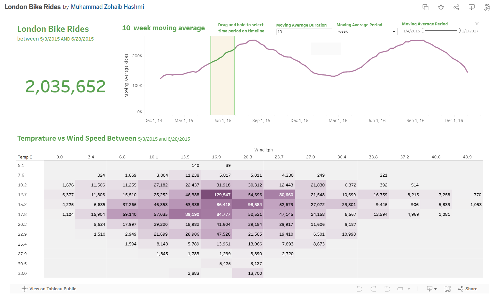

## | Tableau Dashboard - London Bike Sharing | 

# Data Gathering and Manipulation:
This repository encompasses a project centered around the "London bike sharing dataset" sourced from Kaggle. The dataset has been meticulously processed and manipulated utilizing the Pandas library in Python. The resultant file, reflecting the refined dataset, is included within this repository.

# Visualization:
Following the comprehensive manipulation of the dataset, a refined version has been exported to Tableau. Leveraging the capabilities of Tableau, I have meticulously crafted five enriched visualizations, offering insightful perspectives on the underlying data.

<pre>
  <code>
    
#importing the pandas library
import pandas as pd
#reading the csv file
bikes = pd.read_csv('london_merged.csv')
# exploring the data
bikes.info()
<class 'pandas.core.frame.DataFrame'>
RangeIndex: 17414 entries, 0 to 17413
Data columns (total 10 columns):
 #   Column        Non-Null Count  Dtype  
---  ------        --------------  -----  
 0   timestamp     17414 non-null  object 
 1   cnt           17414 non-null  int64  
 2   t1            17414 non-null  float64
 3   t2            17414 non-null  float64
 4   hum           17414 non-null  float64
 5   wind_speed    17414 non-null  float64
 6   weather_code  17414 non-null  float64
 7   is_holiday    17414 non-null  float64
 8   is_weekend    17414 non-null  float64
 9   season        17414 non-null  float64
dtypes: float64(8), int64(1), object(1)
memory usage: 1.3+ MB
bikes.shape
(17414, 10)
bikes
timestamp	cnt	t1	t2	hum	wind_speed	weather_code	is_holiday	is_weekend	season
0	2015-01-04 00:00:00	182	3.0	2.0	93.0	6.0	3.0	0.0	1.0	3.0
1	2015-01-04 01:00:00	138	3.0	2.5	93.0	5.0	1.0	0.0	1.0	3.0
2	2015-01-04 02:00:00	134	2.5	2.5	96.5	0.0	1.0	0.0	1.0	3.0
3	2015-01-04 03:00:00	72	2.0	2.0	100.0	0.0	1.0	0.0	1.0	3.0
4	2015-01-04 04:00:00	47	2.0	0.0	93.0	6.5	1.0	0.0	1.0	3.0
...	...	...	...	...	...	...	...	...	...	...
17409	2017-01-03 19:00:00	1042	5.0	1.0	81.0	19.0	3.0	0.0	0.0	3.0
17410	2017-01-03 20:00:00	541	5.0	1.0	81.0	21.0	4.0	0.0	0.0	3.0
17411	2017-01-03 21:00:00	337	5.5	1.5	78.5	24.0	4.0	0.0	0.0	3.0
17412	2017-01-03 22:00:00	224	5.5	1.5	76.0	23.0	4.0	0.0	0.0	3.0
17413	2017-01-03 23:00:00	139	5.0	1.0	76.0	22.0	2.0	0.0	0.0	3.0
17414 rows × 10 columns

# Lets counts the unique values in weather_code
bikes.weather_code.value_counts()
1.0     6150
2.0     4034
3.0     3551
7.0     2141
4.0     1464
26.0      60
10.0      14
Name: weather_code, dtype: int64
# Lets counts the unique values in season column
bikes.season.value_counts()
0.0    4394
1.0    4387
3.0    4330
2.0    4303
Name: season, dtype: int64
#renaming the column names for better understanding
new_cols_dict = {
    "timestamp": "time",
    "cnt": "count",
    "t1": "temp_real_C",
    "t2": "temp_feels_like_C",
    "hum": "humidity_percent",
    "wind_speed": "wind_speed_kph",
    "weather_code": "weather",
    "is_holiday": "is_holiday",
    "is_weekend": "is_weekend",
    "season": "season"
}

bikes.rename(new_cols_dict, axis=1 , inplace = True)
bikes.humidity_percent = bikes.humidity_percent / 100
# changing the vales to text for better understanding
season_dict = {
    "0.0": "spring",
    "1.0": "summer",
    "2.0": "fall",
    "3.0": "winter"
}
weather_dict = {
    "1.0": "Clear",
    "2.0": "Scattered clouds",
    "3.0": "Broken clouds",
    "4.0": "Cloudy",
    "7.0": "Rain",
    "10.0": "Rain with thunderstorm",
    "26.0": "Snowfall"
}

# change the data type of the "season" column to str
bikes.season = bikes.season.astype('str')
#mapping the values 0-3 to the actual written season
bikes.season = bikes.season.map(season_dict)

# change the data type of the "weather" column to str
bikes.weather = bikes.weather.astype('str')
#mapping the weather to the actual written season
bikes.weather = bikes.weather.map(weather_dict)
# checking the dataframe
bikes.head()
time	count	temp_real_C	temp_feels_like_C	humidity_percent	wind_speed_kph	weather	is_holiday	is_weekend	season
0	2015-01-04 00:00:00	182	3.0	2.0	0.000093	6.0	Broken clouds	0.0	1.0	winter
1	2015-01-04 01:00:00	138	3.0	2.5	0.000093	5.0	Clear	0.0	1.0	winter
2	2015-01-04 02:00:00	134	2.5	2.5	0.000096	0.0	Clear	0.0	1.0	winter
3	2015-01-04 03:00:00	72	2.0	2.0	0.000100	0.0	Clear	0.0	1.0	winter
4	2015-01-04 04:00:00	47	2.0	0.0	0.000093	6.5	Clear	0.0	1.0	winter
# exporting the data 
bikes.to_excel("london_bikes_final.xlsx", sheet_name="Data")
  </code>
</pre>

https://public.tableau.com/app/profile/muhammad.zohaib.hashmi/viz/LondonBikeRides_16996789376210/Dashboard1
